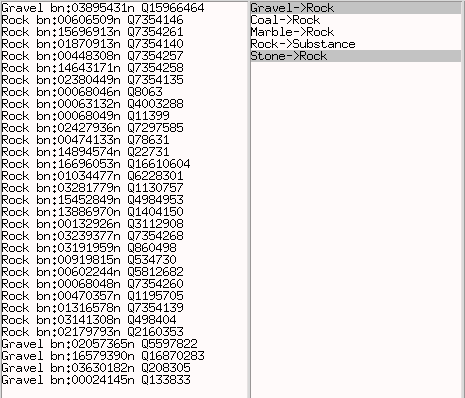
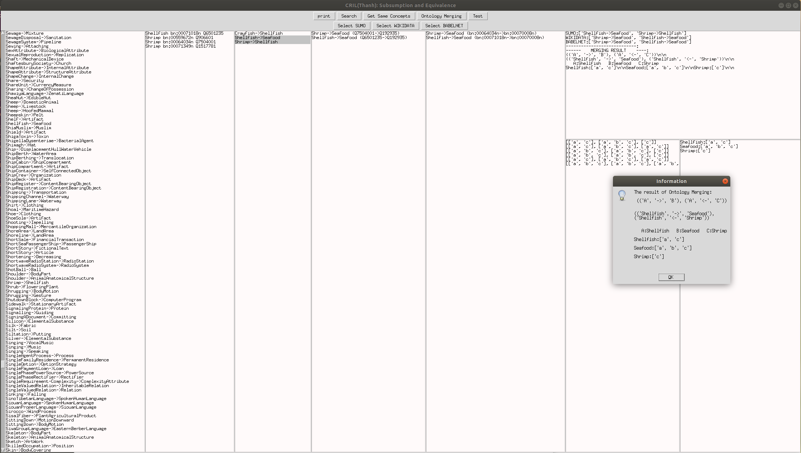
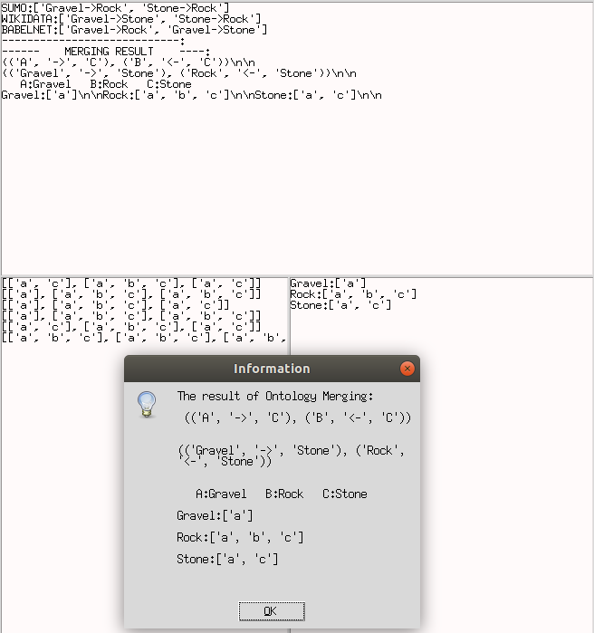
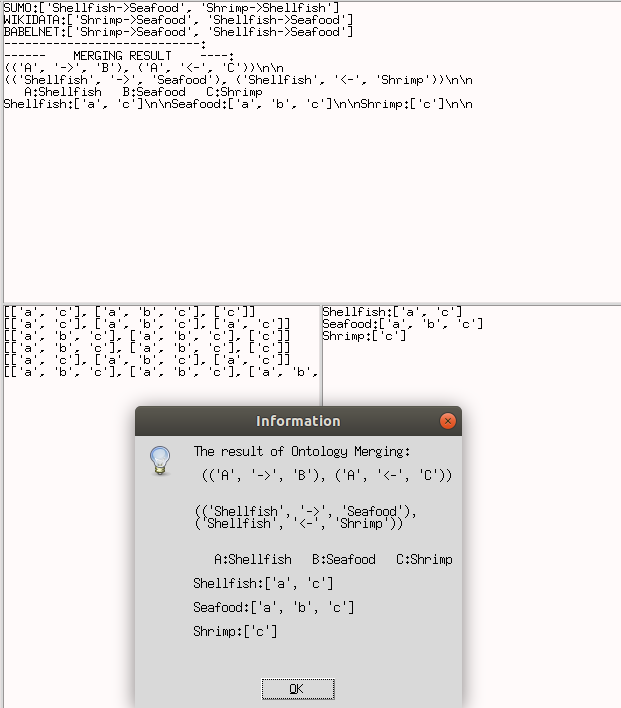

# Belief Merging
Belief Merging in Open-Domain Ontologies

How to run the Ontology Merging application:
```
python3 ./Tools.py
```

Mapping:




An interface of the application:




Some examples:




