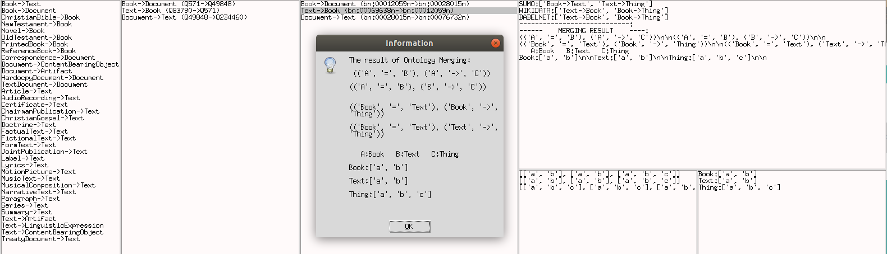
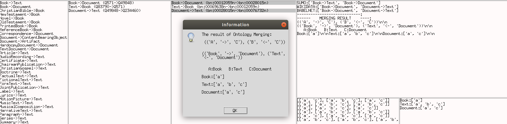
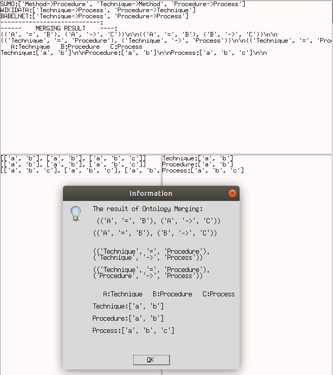
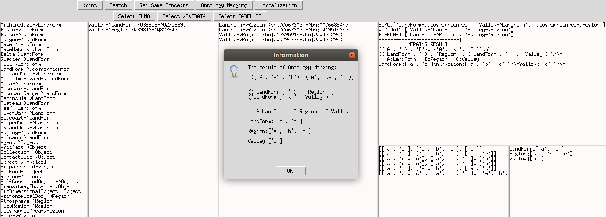

# Belief Merging
## Belief Merging in Open-Domain Ontologies

How to run the Ontology Merging application:
```
python3 Tool.py
```

## Mapping:


## An interface of the application:


Choose concepts to merge from three sources (SUMO, WIKIDATA, BABELNET)


## Some examples:

```
### Example: Seafood, Shellfish, Shrimp
```


```
### Example: Stone, Rock, Gravel
```


### Example: Book, Text and Thing (TOP)



### Example: Book, Text, Document



### Example: Process, Technique, Procedure




### Example: Region, LandForm, Valley




