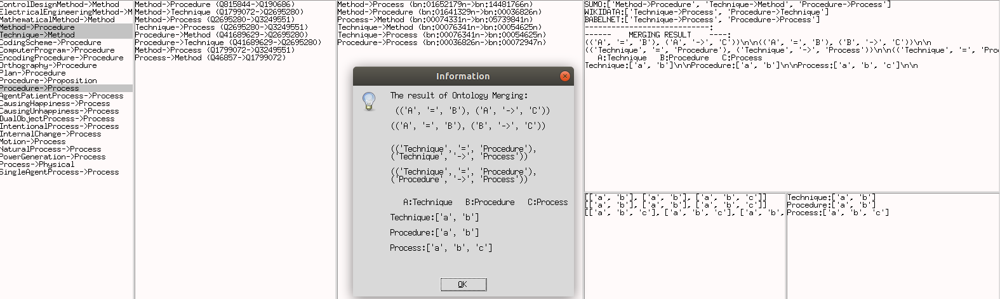

# Belief Merging
## Belief Merging in Open-Domain Ontologies

How to run the Ontology Merging application:
```
python3 Tool.py
```

## Mapping:


## An interface of the application:


Choose concepts to merge from three sources (SUMO, WIKIDATA, BABELNET)


## Some examples:





